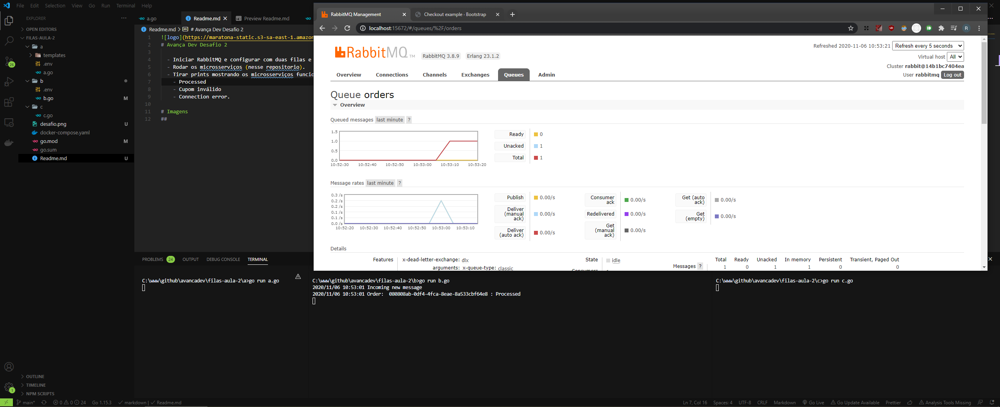
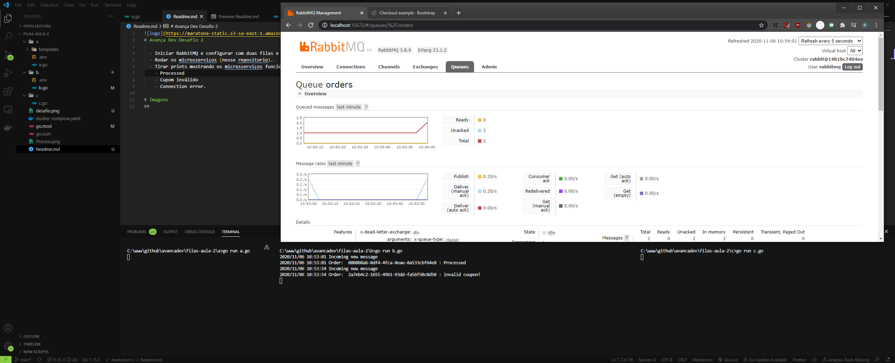
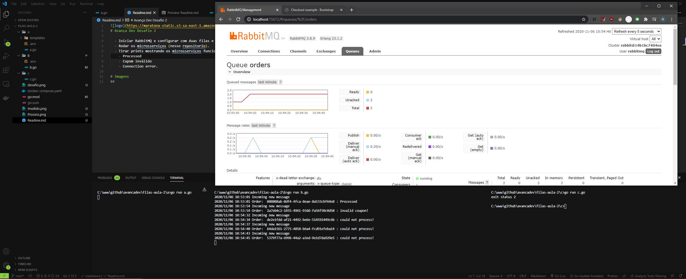

  

# Avança Dev Desafio 2

  - Iniciar RabbitMQ e configurar com duas filas e das duas exchanges.
  - Rodar os microsserviços (nesse repositorio).
  - Tirar prints mostrando os microsserviços funcionando nas 3 situações
    - Processed
    - Cupom inválido
    - Connection error

# Imagens
## Processed

## Cupom inválido

## Connection error

